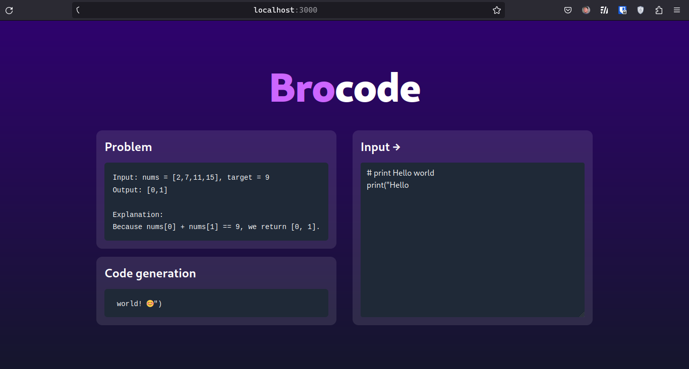

A bro who codes algorithm with you

---

#### Frontend

T3 stack

-   NextJS 13
-   Tailwind

#### Backend

Home-cook AI model

-   FastAPI
-   PyCodeGPT
-   P-tuning v2
-   AlphaCode Dataset
-   Langchain
-   Pinecone

#### Progress

-   [x] Simple UI
-   [x] Send code to backend
-   [x] Generate based only on PyCodeGPT LLM and return to frontend
-   [ ] Deploy to vercel
-   [ ] Prompt tuning that LLM (using P-tuning v2 and AlphaCode Dataset)
-   [ ] Upgrade UI and apply new home-cook model
-   [ ] Store all solutions and discussion into vector database (Pinecone, ...)
-   [ ] Use Langchain and GPT to query from vector database
-   [ ] Hoom cook my own Code to Text model and replace that to GPT model Langchain using above
-   [ ] Upgrade UI/UX
-   [ ] To the moon
