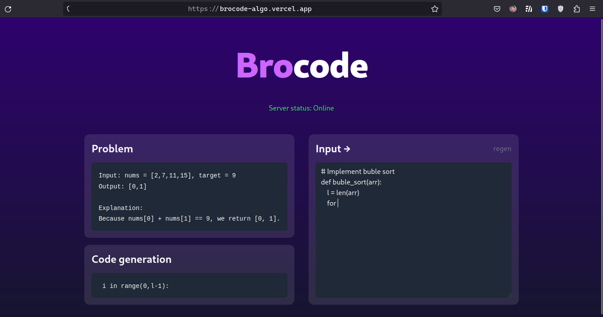

A bro who codes algorithm with you

---

#### Frontend

T3 stack

-   [x] NextJS 13
-   [x] Tailwind
-   [ ] Monaco Editor

#### Backend

Home-cook AI model

-   [x] FastAPI
-   [x] Google Colab + Ngrok
-   [x] PyCodeGPT + CodeGen
-   [x] P-tuning v2 + LoRA
-   [x] AlphaCode Dataset + Leetcode Dataset
-   [ ] Langchain
-   [ ] Pinecone

#### Progress

Tue Apr 25, 2023:

-   [x] Simple UI
-   [x] Send code to backend
-   [x] Generate based only on PyCodeGPT LLM and return to frontend
-   [x] Deploy to vercel
-   [x] Prompt tuning that LLM
-   [x] Using PyCodeGPT 110M
-   [x] Using CodeGen 2B
-   [ ] Using CodeGen 16B
-   [ ] Using P-tuning v2
-   [x] Using LoRA
-   [x] Using AlphaCode Dataset
-   [x] Using Leetcode Dataset
-   [ ] Upgrade UI and apply new home-cook model
-   [ ] Store all solutions and discussion into vector database (Pinecone, ...)
-   [ ] Use Langchain and GPT to query from vector database
-   [ ] Home cook my own Code to Text model and replace that to GPT model Langchain using above
-   [ ] Upgrade UI/UX
-   [ ] To the moon
