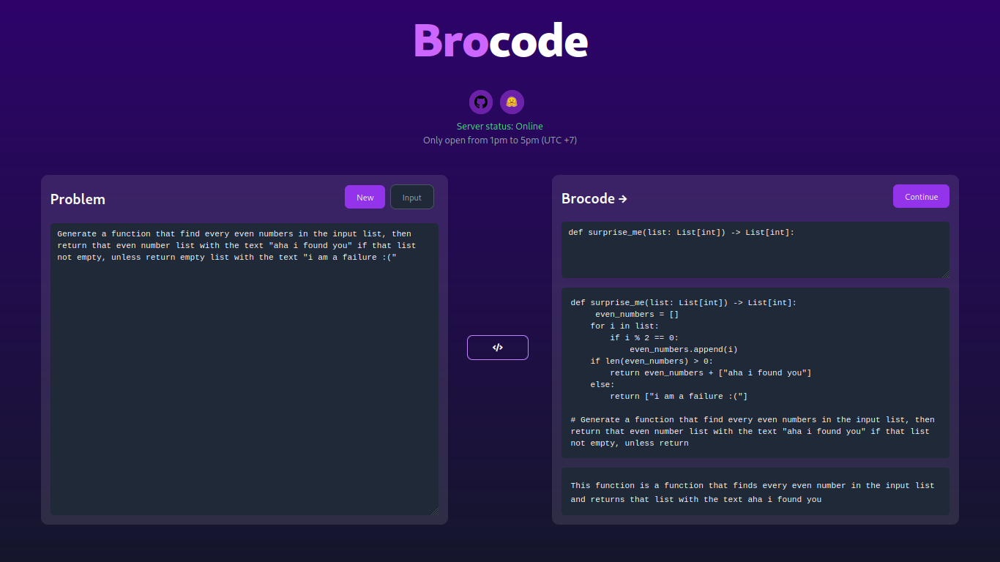

A bro who codes algorithm with you

---

#### Overview

Features:

-   [x] Get random algo problem from leetcode dataset
-   [x] Input your own problem, from simple like "generate a function check if there is any even number in the input list" to medium/hard algorithm problem on leetcode/hackerrank
-   [x] Input your prompt, or your prefix solution
-   [x] AI Generate following solution from your prompt
-   [x] AI Summarize the solution already generated
-   [x] Deployed to vercel and dns map it to [brocode.site](https://brocode.site)

Note: Server only open from 1pm-5pm (UTC +7) due to the :money-limited:

#### Frontend

Architecture:

-   [x] NextJS 13
-   [x] Tailwind
-   [ ] Monaco editor

#### Backend

Architecture:

-   [x] FastAPI
-   [x] Codegen-6B-Mono LoRA tuning with HF Peft
-   [x] CodeT5-large LoRA tuning with HF Peft
-   [x] Downstream dataset from [AlphaCode CodeContests](https://huggingface.co/datasets/deepmind/code_contests), [Leetcode solutions](https://huggingface.co/datasets/mhhmm/leetcode-solutions-python) (python only)
-   [ ] P-tuning v2
-   [ ] Langchain
-   [ ] Pinecone
-   [x] Deployed to a VM Google cloud with n1-highmem-8 vCPU=8 Memory=52GB

#### Kudos

-   **Saleforces** ofcourse, for providing LLM: Codegen-6B-Mono and CodeT5-large
-   Definitely **HuggingFace**, for Peft and an awesome community
-   My thesis advisor **Quan Thanh Tho** for inspiring me with this topic
-   My friend **Thai Tieu Phuong** for helping me train models on Google Colab Pro+
-   My family, with proudly, even though you guys may not care
-   And others

#### Sources

You can find my works here:

-   Website related: This project on Github
-   Adapters: [My HuggingFace](https://huggingface.co/mhhmm)
-   Colab code: [Colab code](https://colab.research.google.com/drive/1dBI4t4Fgn150lAzM_EV6TP0f1_1SYAN-?usp=sharing)

Or contact me [here](https://levuminhhuy.vercel.app/about):

#### Future

-   [ ] Reduce generation time
-   [ ] Benchmark and validation
