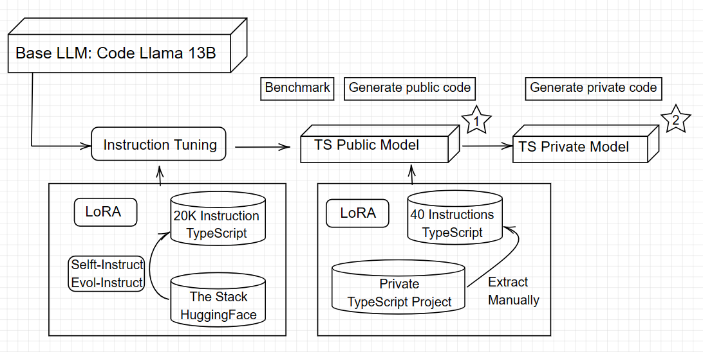

A bro who codes with you

---

#### Overview

Why always Python ? Let's finetune a code generation model for TypeScript only !

#### Dataset

I created a TypeScript-Instruct 20K dataset. It's 20,000 pairs of {instruction, output} that you can't find in any current Code Generation LLMs dataset (or maybe you can)

For the output, thank you HuggingFace, I get TypeScript code data from The Stack project  
For the instruction, thank you OpenAI, I made 20K API call request to generate instruction and explanation for those code data

#### Training

- Base Model: It's the Code Llama - Instruct 13B
- Parameter-Efficient Fine-Tuning method: LoRA
- Using Instruction Tuning with two A100 GPUs

Every other things about training (parameters, logs, ...) you can see it in here (link the HuggingFace Training Metrics link later)

#### Results

I use the MultiPL-E benchmark ([Cassano et al., 2023](https://ieeexplore.ieee.org/document/10103177)) just like the base model Code Llama using in [their paper](https://arxiv.org/abs/2308.12950)

(link the evaluaion result table later)

#### Kudos

-   My family for keep telling me not to quit on this master thesis while I'm a web developer
-   My thesis advisor Assoc. Prof. Quan Thanh Tho for inspiring me with this topic
-   Modal.com for making the training steps much more easier

#### Sources

You can find my works here:

-   Inference Website: https://brocode.site (currently down and not the correct version, but if I somehow finish setup the server, it's will be there)
-   Dataset: [TypeScript-Instruct 20K](https://huggingface.co/datasets/mhhmm/typescript-instruct-20k) (Please ping me if you also want to use this)
-   Fine-tuned Model: TypeScript-Instruct Model (will link later, it will be on my HuggingFace eventually)

Or contact me here: https://levuminhhuy.site/about

#### Future

-   How about Rust ?!
